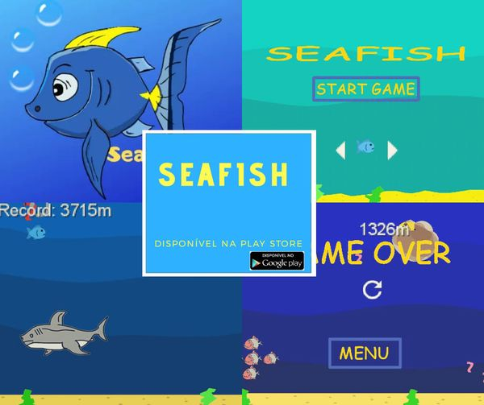

<!DOCTYPE html>
<html lang="pt-br">
<head>
    <meta charset="UTF-8">
    <meta http-equiv="X-UA-Compatible" content="IE=edge">
    <meta name="viewport" content="width=device-width, initial-scale=1.0">
    <title>Seafish</title>
    <link rel="shortcut icon" href="seafish.ico" type="image/x-icon">
    <link rel="stylesheet" href="style.css">
</head>
<body>
    <h1>SEAFISH</h1>
   <main>
    
     
    
    <h2>Você não está sozinho no oceano!</h2>
    

    Desbrave os maiores perigos do oceano,
    percorra os mais variados lugares do fundo do mar ou melhor, tente!
    

    

        Pescadores, predadores e algumas areas exploradas por humanos possuem altaradioatividade,
        apartir deste momento sobreviver sera seu maior desafio! Encare nosso ranking, seja um 
        campeao e ganhe premios! <a class="linkparabaixar" href="https://play.google.com/store/apps/details?id=com.xandi.seafish&hl=pt_BR&gl=US" target="_blank"><strong>BAIXE AGORA!</strong></a>
    

    
    

        <iframe  width="400" height="200" src="https://www.youtube.com/embed/NhRalOGJWiQ"
            title="YouTube video player" frameborder="0" allow="accelerometer; autoplay; clipboard-write; encrypted-media; gyroscope; picture-in-picture" allowfullscreen>
        </iframe>
    

    

    <nav >
        
        
        
    </nav>
    
   
    </main>
</body>
</html>
